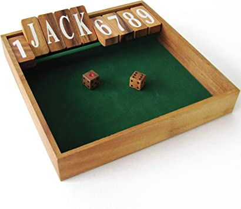

# Jackpot

## The Game

Jackpot is a simple game of chance played _solitaire_ by one person.

The board has a line of 9 cells labelled 1..9, 
each covered by a wooden tile.
The tile can lie down flat or be flipped up.
There is also an enclosure to roll the dice.



The same board is used for a game called *Shut The Box,*
but the rules are different. 
There are also variants of the rules for single-player Jackpot,
but here we use simple Thai bar rules 
\[[Wikipedia](https://en.wikipedia.org/wiki/Shut_the_box#:~:text=Thai%20style%20(Jackpot))\].

At the beginning of the game, 
every cell starts in the flat down position.

For each move, the player rolls 2 six-sided dice, 
then flips up exactly one cell that is in the down position,
but only if the cell number is one of the following:
- individual value of the first die 
- individual value of the second die
- combined value of both dice

For example: a roll of `{3,4}` provides a choice of cells 3, 4 or 7;
a roll of `{2,2}` gives a choice of cells 2 or 4; 
a roll of `{6,6}` only allows cell 6, because there is no cell 12.

If all the cell choices offered by the dice roll 
are already flipped up, then the game is lost. 

The game is won if the player succeeds in 
flipping up all 9 cells. The undersides of the tiles 
now display the winning message, 
typically `*JACKPOT*` or an equivalent Chinese phrase.

## Purpose

*This is not an interactive application to play the game.*

There are three areas of functionality:
- Monte Carlo simulation of random games to establish win/lose statistics.
- Analytic calculation of exact win/lose statistics based on game graph analysis. 
- Dump game graphs to [GraphViz](https://www.graphviz.org) 
  DOT format \[[pdf](https://www.graphviz.org/pdf/dotguide.pdf)\], 
  and optionally generate PNG images if you have GraphViz installed.

## Simple Analysis

Here are some initial observations:

- Cells 1..6 can be flipped by an individual die value.
- Cells 2..9 can be flipped by a combined score.
- Cell 1 can only be flipped by an individual die value.
- Cells 7, 8, 9 can only be flipped using a combined score.

- There are 36 possible rolls of 2 dice.
- There are 2 rolls that only enable 1 cell choice. 
  These are the worst rolls: `{5,5} {6,6}`.
- There are 8 rolls that support only 2 cell choices:
  `{1,1} {2,2} {3,3} {4,4} {6,4}{4,6} {6,5}{5,6}`.
- The remaining 26 rolls support 3 cell choices.

## Cell Probabilities

The total probability for having a choice of flipping a cell 
is the sum of probabilities for the first die value, 
the second die value, and the combined total of both dice.

Here is the matrix of possibilities.
All probabilities are expressed as units of 1/36.

```
+-------+--------------------------------------------+
|       |                    cell                    |
+       +----+----+----+----+----+----+----+----+----+
|  dice |  1 |  2 |  3 |  4 |  5 |  6 |  7 |  8 |  9 |
+-------+----+----+----+----+----+----+----+----+----+----------+
|   A   |  6 |  6 |  6 |  6 |  6 |  6 |    |    |    |  P(cell) |
|   B   |  6 |  6 |  6 |  6 |  6 |  6 |    |    |    |  unit of |
|  A+B  |    |  1 |  2 |  3 |  4 |  5 |  6 |  5 |  4 |   1/36   |
+-------+----+----+----+----+----+----+----+----+----+----------+
|       | 12 | 13 | 14 | 15 | 16 | 17 |  6 |  5 |  4 |   Total  |
+-------+----+----+----+----+----+----+----+----+----+----------+
```

## HiLo Strategy

The HiLo strategy is based on probabilities of 
getting a dice roll that can flip the cell.

The HiLo strategy chooses the cell with the lowest probability 
of being allowed by a roll of 2 dice.
The priority sequence of cells with increasing probability is:

(lowest) `9, 8, 7, 1, 2, 3, 4, 5, 6` (highest)

Another way to think about the sequence is to 
choose the high combined dice values (9,8,7) if possible,
otherwise choose the lowest number cell allowed.

Note the lowest probability cell is 9, with chance 4/36 or 1/9,
so these are the best rolls:

`{5,4}{4,5} {6,3}{3,6}`

## Jackpot Design

It seems that the balance of game design using exactly 9 cells,
comes from the lowest probability cell (1/9) being
expected to occur once in the number of moves of a winning game (9).

For example, if the cells went up to 12, 
the chance of getting 11 is 1/18, 
and the chance of 12 is only 1/36, 
but there are only 12 moves available, 
so it would be very unlikely to win.

## Game Graph

A game graph is a directed graph
containing board positions as nodes and moves as directed edges.
The set of nodes contains all 512 possible board positions.
The board position nodes are labelled with the integer index
calculated from treating the cells as binary digits,
from 1 (least significant) to 9 (most significant).
For example, the position with cells 2 and 4 flipped
corresponds to the binary number `000001010` (note the reversed order)
with an index value of `2^1+2^3 = 2 + 8 = 12`.

The graph is layered by how many moves have been made
from 0 (start) to 9 (win). 
So the layer number, _n,_ is equal to how many cells are flipped up,
and hence the number of 1s in the binary index.
The number of nodes in layer _n_ is the binomial coefficient _9Cn,_
so the layer counts are:

`[ 1, 9, 36, 84, 126, 126, 84, 36, 9, 1 ]`

Each node has up to 36 outgoing edges corresponding to the 
allowed legal moves chosen by a player.
There are no edges within a layer. 
Each layer only has edges going out to members of the next highest layer.
The root (source) node is the starting position (index 0), 
which does not have any incoming edges.
The final (sink) node is the winning position (index 511),
which does not have any outgoing edges.  

```
                       +---+
		START  | 0 |                                Layer 0
                       +---+
	:     :       ///|\\\\ first moves
    flip 1  flip 2       |flip 4
        |     |    :     |      :      :     :       :
      +---+ +---+ +---+ +---+ +----+ +----+ +----+ +-----+ 
      | 1 | | 2 | | 4 | | 8 | | 16 | | 32 | | 64 | | 128 |  Layer 1
      +---+ +---+ +---+ +---+ +----+ +----+ +----+ +-----+
	|     /     :     :      :      :      :      :
	|    /
  flip 2|   /flip 1
	|  /
	| /   :     :     :  
      +---+ +---+ +---+ +---+ 
      | 3 | | 5 | | 6 | | 9 | ..... 36 nodes ....           Layer 2
      +---+ +---+ +---+ +---+                                 :
	:      :    :     :                                   :
							      :
							      :
                         \\|/ winning moves                   :
			+-----+                               :
		   WIN  | 511 |                             Layer 9
			+-----+               
```

The outgoing edges from a board position node
go the next position node in the game Graph.
The edge corresponds to the flipping of exactly one cell in the board.
Each edge is weighted with the count of the number of rolls of the dice
that would lead to that move being chosen by a specific player.

For example, the 15 rolls `{1,3}{3,1} {2,2} {4,*}{*,4}` might all 
result in flipping cell 4 and moving to the same next position node,
so the edge count would be 15 (meaning 15/36 as a probability).

HiLo game graph with layer boxes:


HiLo game graph with move edge labels:


Each node also stores the probability of reaching that position,
which is the sum of probabilites along each path of edges 
leading to the position. 

To calculate the full set of probabilities for every node in the graph:
- Initialize the probability of the start node (index 0) to `1.0`.
- For each position node, in order of layers:
  - For each edge going out from the source node:
      - Calculate the edge contribution as the source node probability
        multiplied by the edge weight, which is `edge count/36`.
      - Increment the destination node probability with the edge contribution.
  - At the last node (index 511, layer 9), there are no outgoing edges,
    and the final value is the winning probability.

## Agents

There are six implementations of player agents that decide the moves of the game:
- `AgentMin`: choose the lowest cell number. 
- `AgentMax`: choose the highest cell number. 
- `AgentFirst`: choose the first cell number. 
- `AgentLast`: choose the last cell number.
- *HiLo:* two versions of the simple optimal algorithm:
  - `AgentHiLo`: using a priority sequence.
  - `AgentHiLo2`: using a max/min rule.

These are 1-line implementations. 
It is easy to add more agent strategies.

## Output

If you want to see the results without running the code, 
here is the output for win percentage (%).

```
CALCULATED
Elixir.Jackpot.AgentMin      : 1.3306
Elixir.Jackpot.AgentMax      : 4.7706
Elixir.Jackpot.AgentFirst    : 1.3105
Elixir.Jackpot.AgentLast     : 5.2248
Elixir.Jackpot.AgentHiLo     : 7.9855
Elixir.Jackpot.AgentHiLo2    : 7.9855

MONTE CARLO (100000)
Elixir.Jackpot.AgentMin      : 1.355
Elixir.Jackpot.AgentMax      : 4.704
Elixir.Jackpot.AgentFirst    : 1.317
Elixir.Jackpot.AgentLast     : 5.232
Elixir.Jackpot.AgentHiLo     : 7.965
Elixir.Jackpot.AgentHiLo2    : 8.031
```
HiLo wins about 8% of the time, so about 2 games in 25.

## Use

Run the tests that generate analytic calculations,
Monte Carlo simulation results, 
and dump out two variants of game graph for the HiLo strategy
[if you do not have GraphViz installed, 
you will see error messages]:

`mix test`

Run dialyzer for type analysis:

`mix dialyzer`

Generate the documentation:

`mix docs`

## License

This software is open source, released under the [MIT License](LICENSE.txt).

The code and documentation are Copyright © 2022 Mike French


